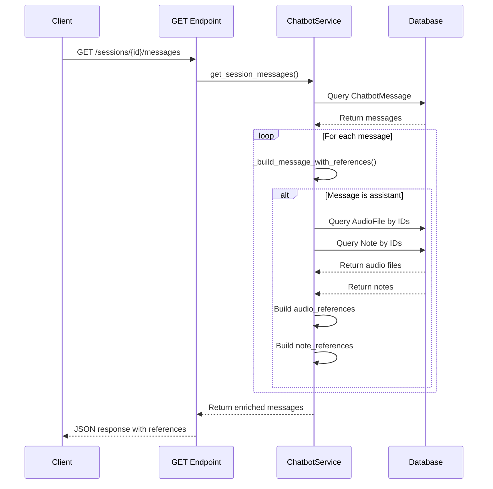

# Enhance Chatbot Message History Endpoint

## Overview

Enhance the `GET /chatbot/sessions/{session_id}/messages` endpoint to return rich message data that matches the format returned by the `POST /chatbot/sessions/{session_id}/messages` endpoint.

## Current Problem

The GET endpoint currently returns simplified message data:

```json
{
  "message_id": "d5cd3734-5016-4b38-b201-1e64e80a472e",
  "role": "assistant",
  "content": "Mình tìm thấy 1 bản ghi âm: transcripted audio",
  "intent": "search",
  "created_at": "2025-12-27T02:57:17.673705"
}
```

But the POST endpoint returns rich data:

```json
{
  "message_id": "d5cd3734-5016-4b38-b201-1e64e80a472e",
  "role": "assistant",
  "response": "Mình tìm thấy 1 bản ghi âm: transcripted audio",
  "intent": "search",
  "audio_references": [
    {
      "audio_id": 30,
      "title": "transcripted audio",
      "duration": 2403.024,
      "created_at": "2025-12-27T01:31:00.676251"
    }
  ],
  "note_references": [
    {
      "note_id": 12,
      "title": "transcripted audio"
    }
  ]
}
```

**Note:** The "role" field (user/assistant) must be kept in the response for both message types.

## Database Schema Reference

The `ChatbotMessage` model already stores the necessary IDs:

```python
# app/models/chatbot_model.py (lines 40-67)
class ChatbotMessage(Base):
    # ... other fields ...
    retrieved_audio_ids = Column(JSONB, nullable=True)  # Stores [1, 2, 3]
    retrieved_note_ids = Column(JSONB, nullable=True)   # Stores [10, 12]
```

## Implementation Steps

### Step 1: Create Helper Method in ChatbotService

**File:** [`app/services/chatbot_service.py`](app/services/chatbot_service.py)

Add a new method to reconstruct rich message data:

```python
def _build_message_with_references(
    self,
    db: Session,
    message: ChatbotMessage
) -> dict:
    """
    Build rich message response with audio and note references.
    
    Args:
        db: Database session
        message: ChatbotMessage model instance
        
    Returns:
        Dictionary with complete message data including references
    """
    from app.models.audio_model import AudioFile
    from app.models.note_model import Note
    
    result = {
        "message_id": message.message_id,
        "role": message.role,
        "response": message.content,
        "intent": message.intent,
        "created_at": message.created_at.isoformat() if message.created_at else None,
    }
    
    # Only add references for assistant messages
    if message.role == "assistant":
        # Build audio_references
        audio_references = []
        if message.retrieved_audio_ids:
            audio_files = db.query(AudioFile).filter(
                AudioFile.id.in_(message.retrieved_audio_ids)
            ).all()
            
            audio_references = [
                {
                    "audio_id": audio.id,
                    "title": audio.original_filename,
                    "duration": audio.duration,
                    "created_at": audio.created_at.isoformat() if audio.created_at else None,
                }
                for audio in audio_files
            ]
        
        # Build note_references
        note_references = []
        if message.retrieved_note_ids:
            notes = db.query(Note).filter(
                Note.id.in_(message.retrieved_note_ids)
            ).all()
            
            note_references = [
                {
                    "note_id": note.id,
                    "title": note.title
                }
                for note in notes
            ]
        
        result["audio_references"] = audio_references
        result["note_references"] = note_references
    
    return result
```

### Step 2: Update get_session_messages Method

**File:** [`app/services/chatbot_service.py`](app/services/chatbot_service.py)

Modify the `get_session_messages` method to use the new helper:

```python
def get_session_messages(
    self,
    db: Session,
    user_id: int,
    session_id: str,
    limit: int = 20,
    offset: int = 0,
) -> dict:
    """Get conversation history for a session."""
    session = self._get_session(db, user_id, session_id)
    
    total = db.query(ChatbotMessage).filter(
        ChatbotMessage.session_id == session_id
    ).count()
    
    messages = (
        db.query(ChatbotMessage)
        .filter(ChatbotMessage.session_id == session_id)
        .order_by(ChatbotMessage.created_at.asc())
        .offset(offset)
        .limit(limit)
        .all()
    )
    
    # Build rich message data with references
    enriched_messages = [
        self._build_message_with_references(db, msg)
        for msg in messages
    ]
    
    return {
        "session": session,
        "messages": enriched_messages,  # Now returns enriched messages
        "total": total,
        "limit": limit,
        "offset": offset,
    }
```

### Step 3: Update Endpoint Response Format

**File:** [`app/api/v1/endpoints/chatbot_endpoints.py`](app/api/v1/endpoints/chatbot_endpoints.py)

Update the GET endpoint (lines 132-183) to pass through the enriched messages:

```python
@router.get("/sessions/{session_id}/messages")
async def get_session_messages(
    session_id: str,
    limit: int = 20,
    offset: int = 0,
    db: Session = Depends(get_db),
    current_user: User = Depends(get_current_active_user),
):
    try:
        result = chatbot_service.get_session_messages(
            db=db,
            user_id=current_user.id,
            session_id=session_id,
            limit=limit,
            offset=offset,
        )
        
        # Messages are already enriched by the service
        # No need to rebuild them here
        response = ResponseCommon.success_response(
            data={
                "session_id": result["session"].session_id,
                "messages": result["messages"],  # Already enriched
                "total": result["total"],
                "limit": result["limit"],
                "offset": result["offset"],
            },
            message="Session history retrieved",
        )
    except ValueError:
        response = ResponseCommon.error_response(
            message="Session not found",
            code=status.HTTP_404_NOT_FOUND,
        )
    except Exception as exc:
        response = ResponseCommon.error_response(
            message=f"Failed to fetch messages: {str(exc)}",
            code=status.HTTP_500_INTERNAL_SERVER_ERROR,
        )

    return Response(
        content=json.dumps(response.to_json()),
        status_code=response.code,
        media_type="application/json",
    )
```

## Expected Response Format

### User Messages

```json
{
  "message_id": "676f1a0a-f863-4e1d-a96b-5cdde9bca68e",
  "role": "user",
  "response": "Tôi muốn biết thêm thông tin về Tô Lăng Nguyệt",
  "intent": "search",
  "created_at": "2025-12-27T02:57:17.672870"
}
```

### Assistant Messages

```json
{
  "message_id": "d5cd3734-5016-4b38-b201-1e64e80a472e",
  "role": "assistant",
  "response": "Mình tìm thấy 1 bản ghi âm: transcripted audio",
  "intent": "search",
  "audio_references": [
    {
      "audio_id": 30,
      "title": "transcripted audio",
      "duration": 2403.024,
      "created_at": "2025-12-27T01:31:00.676251"
    }
  ],
  "note_references": [
    {
      "note_id": 12,
      "title": "transcripted audio"
    }
  ],
  "created_at": "2025-12-27T02:57:17.673705"
}
```

## Implementation Notes

1. **Keep Role Field:** The `role` field (user/assistant) is always included for all messages
2. **Field Name Change:** Changed from `content` to `response` to match POST endpoint format
3. **References Only for Assistant:** Only assistant messages include `audio_references` and `note_references`
4. **Empty Arrays:** If no references exist, return empty arrays `[]` instead of omitting the fields
5. **Performance:** Uses single query per reference type (bulk fetch) instead of N+1 queries
6. **Missing Data Handling:** If audio/note was deleted, it won't appear in references (graceful degradation)

## Testing Checklist

- [ ] GET endpoint returns enriched data for assistant messages
- [ ] User messages don't have audio_references/note_references fields (or have empty arrays)
- [ ] Field name changed from 'content' to 'response'
- [ ] Deleted audio files don't cause errors
- [ ] Deleted notes don't cause errors
- [ ] Pagination still works correctly
- [ ] Performance is acceptable with large message histories
- [ ] Frontend can consume the new format

## Migration Considerations

### Backward Compatibility

If frontend needs gradual migration, temporarily include both fields:

```python
result = {
    "message_id": message.message_id,
    "role": message.role,
    "content": message.content,  # Keep for backward compatibility
    "response": message.content,  # New field
    # ... rest of fields
}
```

Remove `content` field after frontend migration is complete.

## Files to Modify

1. [`app/services/chatbot_service.py`](app/services/chatbot_service.py)
   - Add `_build_message_with_references()` method
   - Update `get_session_messages()` method

2. [`app/api/v1/endpoints/chatbot_endpoints.py`](app/api/v1/endpoints/chatbot_endpoints.py)
   - Update `get_session_messages()` endpoint (lines 132-183)

## Example Implementation Flow



## Performance Optimization

If performance becomes an issue with large conversations:

1. **Eager Loading:** Use SQLAlchemy joinedload/selectinload
2. **Caching:** Cache audio/note metadata for frequently accessed items
3. **Lazy Loading Option:** Add query parameter `include_references=true/false`

## Summary

This enhancement makes the GET endpoint return consistent, rich data matching the POST endpoint format. The implementation reuses existing stored IDs in the database and reconstructs the full object details on retrieval.

