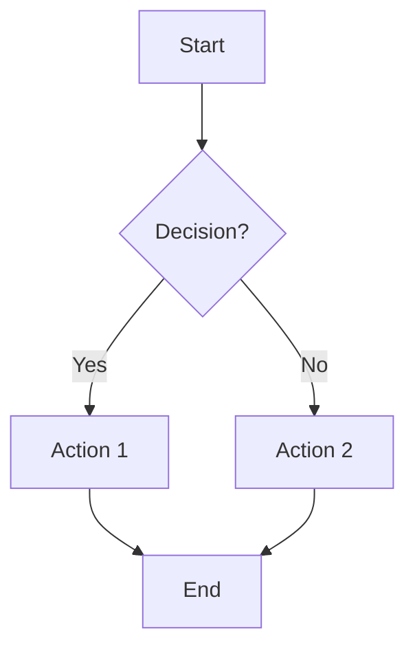
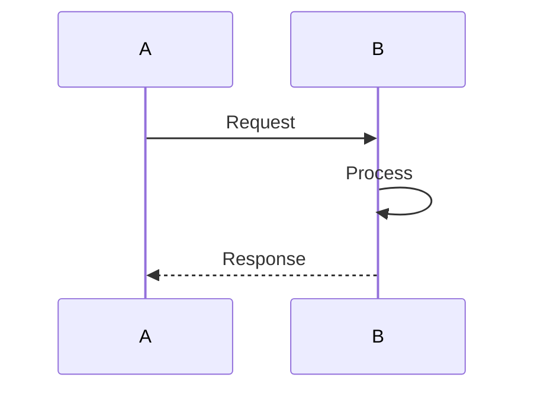
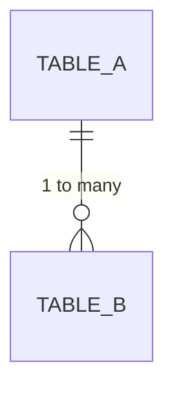
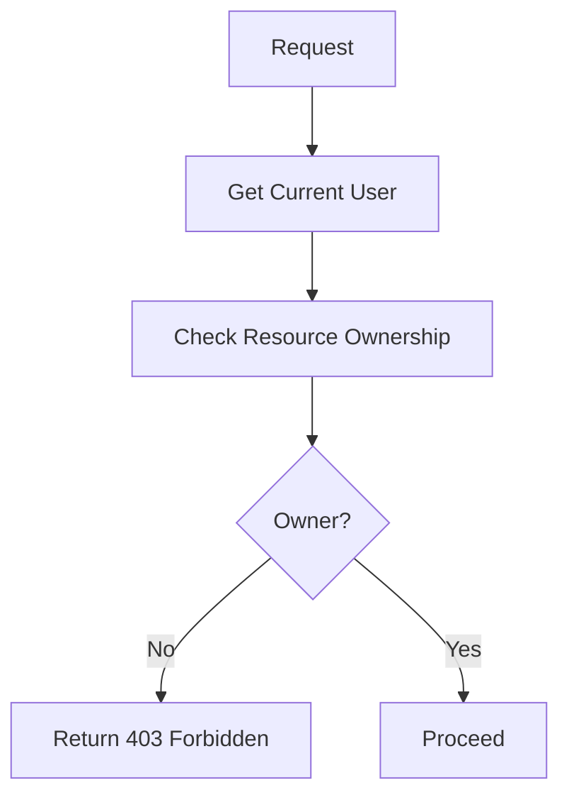
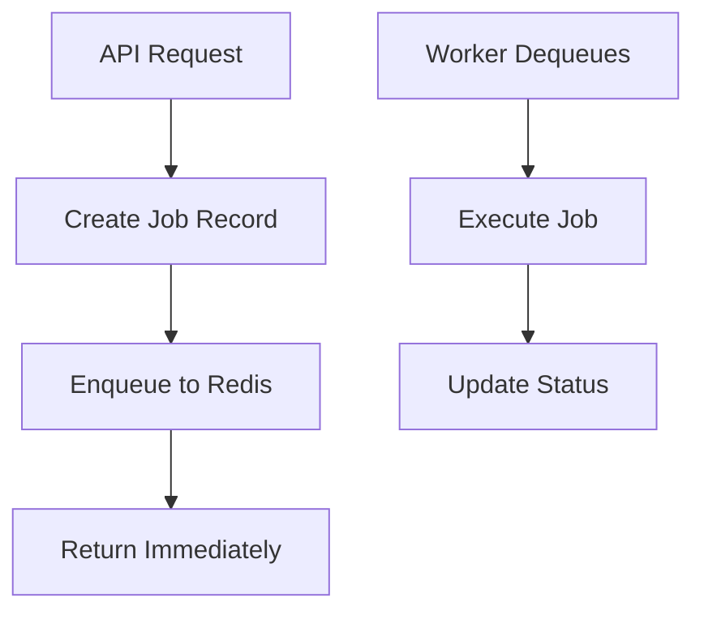
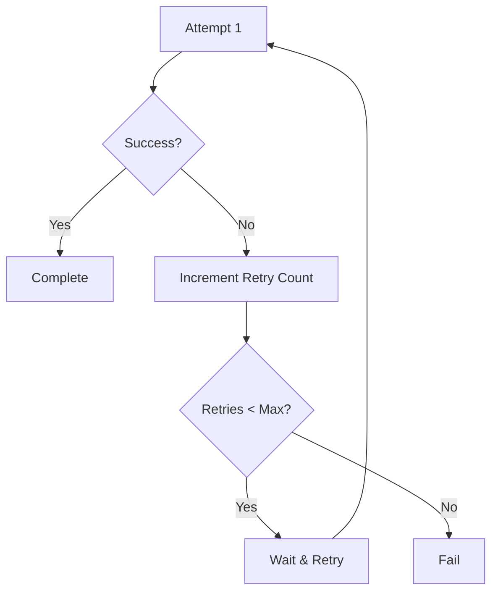
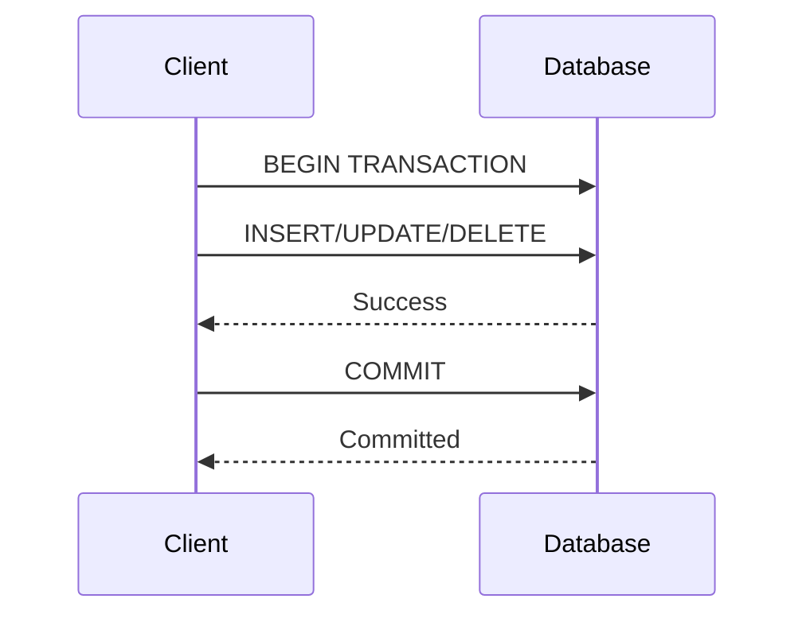
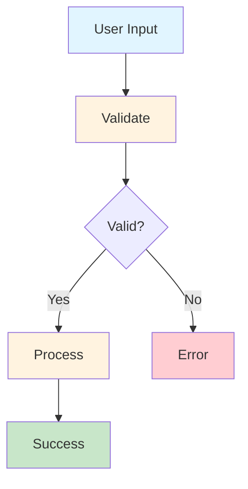
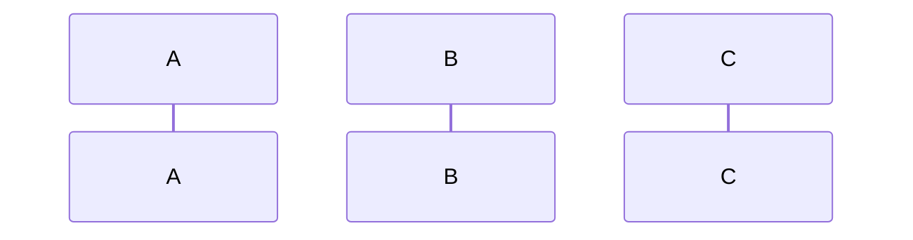

# Quick Reference: Diagram Types & Use Cases

## Overview of All Diagrams

This quick reference helps you understand what each diagram shows and when to create new ones.

---

## Group 1: Authentication Flows (01_authentication_flows.md)

| Diagram | Type | Best For | Key Participants |
|---------|------|----------|------------------|
| User Registration | Flowchart | First-time user onboarding | User, FastAPI, Database, Email Service |
| User Login | Flowchart | Understanding auth process | User, FastAPI, Database, JWT Token |
| Token Refresh | Flowchart | Session extension | Client, FastAPI, Redis |
| Complete Auth Flow | Sequence | End-to-end authentication | Client, API, Database, Redis, Email |

**When to update**: When auth logic changes (new 2FA, OAuth integration)

---

## Group 2: Audio Management Flows (02_audio_management_flows.md)

| Diagram | Type | Best For | Key Participants |
|---------|------|----------|------------------|
| Audio Upload | Flowchart | Understanding upload process | User, FastAPI, GCS, Database |
| Audio Processing Pipeline | Flowchart | Background job processing | TaskJob, Worker, Speech API, Database |
| Audio Retrieval | Flowchart | Data fetching | User, FastAPI, Database |
| Complete Upload & Processing | Sequence | Full pipeline visualization | Client, API, Storage, DB, Worker, ML API |

**When to update**: When upload/processing logic changes

---

## Group 3: Async Task Processing (03_async_task_processing.md)

| Diagram | Type | Best For | Key Participants |
|---------|------|----------|------------------|
| Task Job Lifecycle | Flowchart | Understanding job states | TaskJob, Queue, Worker |
| Error Handling & Retry | Flowchart | Error recovery strategies | Task, Exception Handling, Queue |
| Task Processing with Worker | Sequence | Worker interaction | API, Redis, Worker, Services, Database |

**When to update**: When task queue or retry logic changes

---

## Group 4: Note Generation Flows (04_note_generation_flows.md)

| Diagram | Type | Best For | Key Participants |
|---------|------|----------|------------------|
| Automatic Notes from Audio | Flowchart | Auto-generation process | Transcript, NLP, Database |
| Manual Note Creation | Flowchart | User editing workflow | User, FastAPI, Database, Embeddings |
| Note Search with Embeddings | Flowchart | Semantic search | Query, Embeddings, Vector DB |
| Complete Note Lifecycle | Sequence | Full note journey | User, API, Database, ML, Vector DB |

**When to update**: When note generation or search changes

---

## Group 5: Chatbot Interaction Flows (05_chatbot_interaction_flows.md)

| Diagram | Type | Best For | Key Participants |
|---------|------|----------|------------------|
| Session Initialization | Flowchart | Chat session setup | User, FastAPI, Audio, Database |
| RAG Response Generation | Flowchart | Context-aware responses | User Message, Search, LLM, Context |
| Intent Detection | Flowchart | User intent routing | Message, Intent Classifier, Actions |
| Complete Chatbot Interaction | Sequence | End-to-end chat flow | User, API, Vector DB, LLM Provider |

**When to update**: When chatbot logic or LLM integration changes

---

## Group 6: Folder Organization Flows (06_folder_organization_flows.md)

| Diagram | Type | Best For | Key Participants |
|---------|------|----------|------------------|
| Folder CRUD Operations | Flowchart | Create/Update/Delete | User, FastAPI, Database |
| Moving Audio Between Folders | Flowchart | Audio organization | User, Audio, Folder, Database |
| Folder Deletion Cascade | Flowchart | Data cleanup | Folder, Audio Files, Database |
| Complete Folder Management | Sequence | Full folder operations | User, API, Database |

**When to update**: When folder features change (sharing, nested folders)

---

## Group 7: Notification System Flows (07_notification_system_flows.md)

| Diagram | Type | Best For | Key Participants |
|---------|------|----------|------------------|
| Notification Trigger & Queue | Flowchart | Event to queue | Event, Creation, Database, Redis |
| Multi-Channel Delivery | Flowchart | Different delivery methods | FCM, WebSocket, Email, User |
| Preferences Management | Flowchart | User settings | User, FastAPI, Database |
| End-to-End Notification | Sequence | Complete notification journey | Worker, API, Redis, FCM, Email, Client |

**When to update**: When adding new notification channels or triggers

---

## Group 8: Database Relationships (08_database_relationships.md)

| Diagram | Type | Best For | Key Participants |
|---------|------|----------|------------------|
| Entity Relationship Diagram | ER Diagram | Schema understanding | All database tables |
| Data Flow Through System | Graph | Data pipeline | Input → Processing → Output |

**When to update**: When adding new tables or relationships

---

## Choosing the Right Diagram Type

### Use Flowchart When:
- Showing decision points and conditional logic
- Illustrating a process with multiple steps
- Demonstrating error handling paths
- Single linear or tree-like flow



### Use Sequence Diagram When:
- Multiple participants interact
- Showing message/data flow between components
- Illustrating timing or order of operations
- Demonstrating client-server interactions



### Use ER Diagram When:
- Showing database schema
- Illustrating table relationships
- Understanding data model
- Showing cardinality (one-to-many, etc.)



---

## Template: Creating a New Diagram Group

When you need to document a new flow:

1. **Identify the flow name** (e.g., "Payment Processing")
2. **List all participants** (services, databases, external APIs)
3. **Choose diagram type**:
   - Simple flow → Flowchart
   - Multi-actor interactions → Sequence
4. **Draft the flow**: Draw on paper or whiteboard first
5. **Code in Mermaid**: Use syntax examples above
6. **Test**: Paste in https://mermaid.live/
7. **Add to guide**: Create new markdown file
8. **Document**: Add context and error handling

---

## Common Patterns

### Pattern 1: Authorization Check


### Pattern 2: Async Job Processing


### Pattern 3: Error Handling with Retry


### Pattern 4: Database Transaction


---

## Styling Guide

### Color Meanings
```
Input/Request:      #e1f5ff  (Light Blue)
Processing:         #fff3e0  (Light Orange)
External Service:   #ffe0b2  (Darker Orange)
Success/Output:     #c8e6c9  (Light Green)
Error/Failure:      #ffcdd2  (Light Red)
Critical Error:     #ff5252  (Red)
Warning:            #ffe082  (Yellow)
```

### Example with Colors


---

## Validation Checklist

Before considering a diagram complete:

- [ ] All flows have clear start and end points
- [ ] Decision nodes have labeled branches (Yes/No)
- [ ] Error paths are shown
- [ ] External services are labeled clearly
- [ ] Database operations are shown
- [ ] Async operations are differentiated
- [ ] Styling is consistent with guide
- [ ] Node labels are clear and concise
- [ ] No overcrowded nodes (split if >5 connections)
- [ ] Mermaid syntax is valid (tested on https://mermaid.live/)

---

## Tool References

### Mermaid Syntax Quick Links
- **Flowchart**: https://mermaid.js.org/syntax/flowchart.html
- **Sequence**: https://mermaid.js.org/syntax/sequenceDiagram.html
- **ER Diagram**: https://mermaid.js.org/syntax/entityRelationshipDiagram.html
- **Git Graph**: https://mermaid.js.org/syntax/gitGraph.html
- **State**: https://mermaid.js.org/syntax/stateDiagram.html

### Online Tools
- **Mermaid Live**: https://mermaid.live/ (Recommended for testing)
- **Draw.io**: https://draw.io/ (Alternative tool)
- **Excalidraw**: https://excalidraw.com/ (Hand-drawn style)

### VS Code Extensions
- **Markdown Preview Mermaid Support**: Renders diagrams in preview
- **Mermaid Markdown Syntax Highlighting**: Syntax highlighting for mermaid blocks

---

## Tips for Clear Diagrams

1. **Keep It Simple**: One main concept per diagram
2. **Use Meaningful Names**: Node labels should be self-explanatory
3. **Show Error Paths**: Don't hide error handling
4. **Consistent Direction**: Use consistent flow direction (top-down, left-right)
5. **Avoid Crossing Lines**: Rearrange to minimize line crossings
6. **Color Purpose**: Use colors to highlight important aspects
7. **Add Context**: Include description above the diagram
8. **Test Completeness**: Trace through the flow manually

---

## Maintenance Schedule

- **Monthly**: Review for accuracy against code
- **After Major Features**: Update affected diagrams
- **Quarterly**: Check for outdated information
- **During Refactoring**: Update simultaneously with code

---

## Questions & Answers

**Q: How do I add a new sequence participant?**
A: Add to participant declaration:


**Q: Can I use notes in diagrams?**
A: Yes, in sequence diagrams:
```mermaid
Note over A: This is a note
Note over A,B: Spans multiple participants
```

**Q: How do I show async operations?**
A: Use different line styles in sequence diagrams:
```mermaid
A->>B: Synchronous
A-->>B: Asynchronous
A-)B: Open arrow
```

**Q: Should I include timestamps?**
A: For complex sequences, add notes with timing info.

**Q: Can I nest decision diamonds?**
A: Yes, but keep it simple (max 2 levels recommended).

---

**Last Updated**: December 30, 2025
