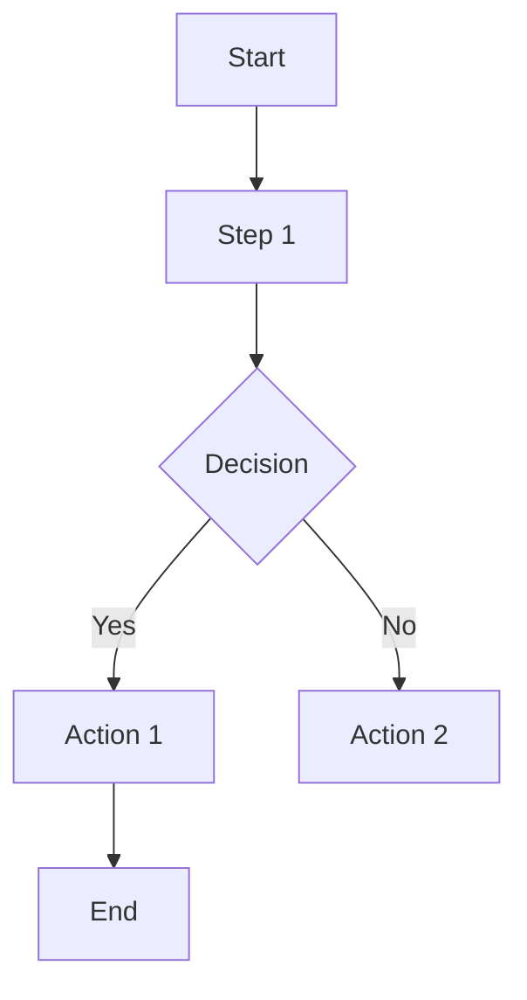
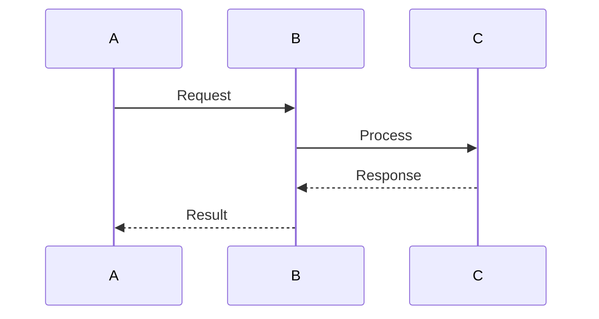
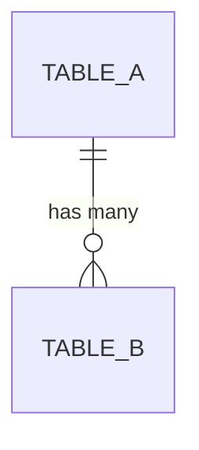

# 🎯 Voicely-BE Mermaid Diagrams - Getting Started

## Welcome! 👋

You now have a complete set of mermaid diagram guides and templates for the Voicely-BE project. This document will help you get started quickly.

---

## 📦 What You've Got

### 📄 Documentation Files (5 files)

1. **[MERMAID_DIAGRAMS_GUIDE.md](MERMAID_DIAGRAMS_GUIDE.md)** ⭐ **START HERE**
   - 📊 Complete guide with all diagram examples
   - 🎨 Styling conventions and best practices
   - 💡 Implementation instructions
   - 🔧 Syntax reference
   - **Read Time**: 20-30 minutes
   - **Best For**: Understanding all diagrams in detail

2. **[DIAGRAMS_QUICK_REFERENCE.md](DIAGRAMS_QUICK_REFERENCE.md)**
   - ⚡ Quick lookup tables
   - 🎯 When to update each diagram
   - 🔍 Diagram type selection guide
   - 📋 Common patterns
   - **Read Time**: 10-15 minutes
   - **Best For**: Quick navigation and reference

3. **[DIAGRAMS_INDEX.md](DIAGRAMS_INDEX.md)**
   - 🗺️ Navigation overview
   - 🔗 Quick links to all diagrams
   - 📚 Learning path
   - 🎓 FAQ
   - **Read Time**: 5-10 minutes
   - **Best For**: Finding what you need

4. **[DIAGRAM_FILE_TEMPLATE.md](DIAGRAM_FILE_TEMPLATE.md)**
   - 📋 Copy-paste ready template
   - ✍️ Structure for new diagrams
   - 💬 Customization examples
   - **Read Time**: 5 minutes
   - **Best For**: Creating new diagram groups

5. **[DIAGRAM_IMPLEMENTATION_CHECKLIST.md](DIAGRAM_IMPLEMENTATION_CHECKLIST.md)**
   - ✅ Quality assurance checklist
   - 🔍 Verification steps
   - 📊 Statistics and metrics
   - **Read Time**: 5 minutes
   - **Best For**: Ensuring diagram quality

### 🎨 Diagram Files (8 groups, 33 diagrams)

Located in `docs/diagrams/`:

| File | Group | Diagrams | Focus |
|------|-------|----------|-------|
| `01_authentication_flows.md` | Authentication | 4 | User login, registration, tokens |
| `02_audio_management_flows.md` | Audio | 4 | Upload, processing, retrieval |
| `03_async_task_processing.md` | Tasks | 3 | Background jobs, retry logic |
| `04_note_generation_flows.md` | Notes | 4 | Auto generation, search, lifecycle |
| `05_chatbot_interaction_flows.md` | Chatbot | 4 | Sessions, RAG, intent detection |
| `06_folder_organization_flows.md` | Folders | 4 | CRUD, organization, cascading |
| `07_notification_system_flows.md` | Notifications | 4 | Triggers, channels, preferences |
| `08_database_relationships.md` | Database | 2 | Schema, relationships |

---

## 🚀 Quick Start (5 minutes)

### For Beginners

1. **Read this file** (you're doing it! ✓)
2. **Open [DIAGRAMS_INDEX.md](DIAGRAMS_INDEX.md)** (5 min)
3. **Browse [MERMAID_DIAGRAMS_GUIDE.md](MERMAID_DIAGRAMS_GUIDE.md)** (20 min)
4. **Find your feature** in the diagram groups
5. **Done!** You now understand the flow

### For Creating New Diagrams

1. **Review [DIAGRAMS_QUICK_REFERENCE.md](DIAGRAMS_QUICK_REFERENCE.md#choosing-the-right-diagram-type)**
2. **Copy [DIAGRAM_FILE_TEMPLATE.md](DIAGRAM_FILE_TEMPLATE.md)**
3. **Draft on [Mermaid Live](https://mermaid.live/)**
4. **Complete template sections**
5. **Get peer review**
6. **Merge to docs**

### For Understanding Your Feature

1. **Find your feature** in the table below
2. **Open the diagram file**
3. **Study the related flows**
4. **Reference actual code**
5. **Ask questions** if unclear

---

## 🔍 Find Your Feature

### By Feature Name

| Feature | File | Diagrams |
|---------|------|----------|
| **Authentication** | [01_authentication_flows.md](docs/diagrams/01_authentication_flows.md) | Registration, Login, Token Refresh |
| **Audio Upload** | [02_audio_management_flows.md](docs/diagrams/02_audio_management_flows.md) | Upload, Processing, Retrieval |
| **Background Jobs** | [03_async_task_processing.md](docs/diagrams/03_async_task_processing.md) | Task Lifecycle, Retry, Worker |
| **Notes & Search** | [04_note_generation_flows.md](docs/diagrams/04_note_generation_flows.md) | Auto-Generate, Manual, Search |
| **Chatbot & AI** | [05_chatbot_interaction_flows.md](docs/diagrams/05_chatbot_interaction_flows.md) | Sessions, RAG, Intent |
| **Folders** | [06_folder_organization_flows.md](docs/diagrams/06_folder_organization_flows.md) | CRUD, Moving, Deletion |
| **Notifications** | [07_notification_system_flows.md](docs/diagrams/07_notification_system_flows.md) | Triggers, Channels, Delivery |
| **Database** | [08_database_relationships.md](docs/diagrams/08_database_relationships.md) | Schema, Relationships |

### By Component

| Component | Uses These Diagrams |
|-----------|-------------------|
| **FastAPI** | All groups (1-8) |
| **PostgreSQL** | All groups (1-8) |
| **Redis** | Groups 3, 7 (Tasks, Notifications) |
| **GCS Storage** | Group 2 (Audio Management) |
| **Vector DB** | Groups 4, 5 (Notes, Chatbot) |
| **Speech API** | Group 2 (Audio Management) |
| **LLM API** | Group 5 (Chatbot) |
| **Firebase Cloud Messaging** | Group 7 (Notifications) |

---

## 📊 What Each Diagram Type Shows

### 🔄 Flowchart (Most Diagrams)
Shows decision points and step-by-step process flow.

**Use when**: 
- Single actor/system decision flow
- Error conditions and branching
- Process steps in order

**Example**: User Registration, Audio Upload, Folder Creation



### 📨 Sequence Diagram (7 Diagrams)
Shows interactions between multiple components over time.

**Use when**:
- Multiple services interact
- Showing request/response flow
- Client-server interactions

**Example**: Complete Authentication, Audio Upload & Processing



### 📊 ER Diagram (Database)
Shows database tables and relationships.

**Use when**:
- Understanding data model
- Seeing table relationships
- Schema design



---

## 📚 Reading Guide

### 5 Minute Overview
1. This file
2. [DIAGRAMS_INDEX.md](DIAGRAMS_INDEX.md)

### 15 Minute Quick Start
1. This file (5 min)
2. [DIAGRAMS_QUICK_REFERENCE.md](DIAGRAMS_QUICK_REFERENCE.md) (10 min)

### 1 Hour Deep Dive
1. This file (5 min)
2. [DIAGRAMS_QUICK_REFERENCE.md](DIAGRAMS_QUICK_REFERENCE.md) (10 min)
3. [DIAGRAMS_INDEX.md](DIAGRAMS_INDEX.md) (10 min)
4. [MERMAID_DIAGRAMS_GUIDE.md](MERMAID_DIAGRAMS_GUIDE.md) (30 min)

### Complete Mastery
1. Read all documentation files (45 min)
2. Study all diagram files (45 min)
3. Review code implementations (30 min)
4. Create your own diagram (30 min)

---

## 🎨 Color Legend

All diagrams use consistent colors:

| Color | Hex | Meaning | Usage |
|-------|-----|---------|-------|
| Light Blue | `#e1f5ff` | **Input/Start** | User requests, starting points |
| Light Orange | `#fff3e0` | **Processing** | API processing, database operations |
| Darker Orange | `#ffe0b2` | **External** | External APIs, services |
| Light Green | `#c8e6c9` | **Success** | Successful completion |
| Light Red | `#ffcdd2` | **Error** | Error conditions |
| Red | `#ff5252` | **Critical** | Critical failures |

---

## ✨ Key Features of This Documentation

### ✅ Comprehensive
- 33 diagrams covering all features
- 4 detailed guide documents
- Real code examples
- Error handling included

### ✅ Well-Organized
- Grouped by functionality
- Clear navigation
- Quick reference tables
- Multiple entry points

### ✅ Actionable
- Template for new diagrams
- Step-by-step instructions
- Checklist for quality
- Best practices included

### ✅ Easy to Maintain
- Versioning system
- Update guidelines
- Maintenance schedule
- Change tracking

---

## 🛠️ Tools You'll Need

### Required
- **Browser**: To view markdown files
- **Text Editor**: VS Code recommended
- **Git**: To commit changes

### Highly Recommended
- **VS Code Extension**: "Markdown Preview Mermaid Support"
  ```bash
  # Install directly in VS Code
  # Extensions > Search "mermaid"
  ```

### Optional
- **Mermaid Live Editor**: https://mermaid.live/ (for testing)
- **Draw.io**: https://draw.io/ (alternative diagramming tool)

---

## 🚀 Common Tasks

### I need to understand a feature
1. Find it in "Find Your Feature" table above
2. Open the diagram file
3. Read the flow descriptions
4. Study the code implementation

### I need to create a new diagram
1. Read [DIAGRAM_FILE_TEMPLATE.md](DIAGRAM_FILE_TEMPLATE.md)
2. Look at similar existing diagram
3. Use [Mermaid Live](https://mermaid.live/) to draft
4. Copy template and customize
5. Get peer review
6. Commit changes

### I found an error in a diagram
1. Verify the error with code
2. Update the diagram file
3. Test syntax on [Mermaid Live](https://mermaid.live/)
4. Get peer review
5. Commit fix with description

### I want to add a new flow
1. Identify the flow
2. Choose diagram type
3. Follow [DIAGRAM_FILE_TEMPLATE.md](DIAGRAM_FILE_TEMPLATE.md)
4. Create in appropriate group
5. Test and review
6. Add to index

---

## 📖 Documentation Map

```
docs/
├── 🎯 GETTING_STARTED.md           ← You are here
├── 📘 MERMAID_DIAGRAMS_GUIDE.md    ← Complete guide
├── ⚡ DIAGRAMS_QUICK_REFERENCE.md  ← Quick lookup
├── 🗺️  DIAGRAMS_INDEX.md            ← Navigation
├── 📋 DIAGRAM_FILE_TEMPLATE.md     ← Template
├── ✅ DIAGRAM_IMPLEMENTATION_CHECKLIST.md
│
└── diagrams/                        ← All actual diagrams
    ├── 01_authentication_flows.md
    ├── 02_audio_management_flows.md
    ├── 03_async_task_processing.md
    ├── 04_note_generation_flows.md
    ├── 05_chatbot_interaction_flows.md
    ├── 06_folder_organization_flows.md
    ├── 07_notification_system_flows.md
    └── 08_database_relationships.md
```

---

## 💡 Pro Tips

### 1. Bookmark Important Pages
- [MERMAID_DIAGRAMS_GUIDE.md](MERMAID_DIAGRAMS_GUIDE.md) - For detailed info
- [DIAGRAMS_INDEX.md](DIAGRAMS_INDEX.md) - For quick navigation
- [Mermaid Live](https://mermaid.live/) - For testing syntax

### 2. Use Keyboard Shortcuts
- **VS Code**: `Ctrl+Shift+V` to preview markdown
- **GitHub**: Click "View code" to see raw markdown

### 3. Ask Questions
If a diagram isn't clear:
1. Check [DIAGRAMS_QUICK_REFERENCE.md](DIAGRAMS_QUICK_REFERENCE.md#qa)
2. Read code implementation
3. Ask colleague for explanation

### 4. Keep Diagrams Updated
- Update when code changes
- Track changes in git commit
- Notify team of diagram updates

### 5. Use Diagrams in Code Review
- Reference diagrams when reviewing PRs
- Ensure code matches diagrams
- Update diagrams if behavior changes

---

## 🎓 Learning Timeline

### Day 1: Overview (30 minutes)
- [ ] Read this file
- [ ] Skim [DIAGRAMS_INDEX.md](DIAGRAMS_INDEX.md)
- [ ] Look at 1-2 diagram groups

### Day 2: Deep Dive (1-2 hours)
- [ ] Read [MERMAID_DIAGRAMS_GUIDE.md](MERMAID_DIAGRAMS_GUIDE.md)
- [ ] Study your feature's diagrams
- [ ] Compare with code implementation

### Day 3: Practice (1 hour)
- [ ] Create a simple diagram
- [ ] Use [Mermaid Live](https://mermaid.live/)
- [ ] Get feedback from colleague

### Day 4: Mastery (ongoing)
- [ ] Reference diagrams during development
- [ ] Update when features change
- [ ] Help others understand flows

---

## ❓ Quick FAQ

**Q: Which file should I read first?**
A: Start with this file, then [DIAGRAMS_INDEX.md](DIAGRAMS_INDEX.md)

**Q: Can I use these diagrams in presentations?**
A: Yes! They're public documentation.

**Q: How do I add a new flow?**
A: Follow [DIAGRAM_FILE_TEMPLATE.md](DIAGRAM_FILE_TEMPLATE.md)

**Q: What if I find an error?**
A: Fix it and create a PR. See [MERMAID_DIAGRAMS_GUIDE.md](MERMAID_DIAGRAMS_GUIDE.md#updating-diagrams)

**Q: Can I change the colors?**
A: Follow conventions in [DIAGRAMS_QUICK_REFERENCE.md](DIAGRAMS_QUICK_REFERENCE.md#styling-guide)

**Q: How often are these updated?**
A: See [MERMAID_DIAGRAMS_GUIDE.md](MERMAID_DIAGRAMS_GUIDE.md#maintenance-schedule)

---

## 🔗 Quick Links

### Documentation
- [Complete Guide](MERMAID_DIAGRAMS_GUIDE.md)
- [Quick Reference](DIAGRAMS_QUICK_REFERENCE.md)
- [Navigation Index](DIAGRAMS_INDEX.md)
- [Template](DIAGRAM_FILE_TEMPLATE.md)
- [Checklist](DIAGRAM_IMPLEMENTATION_CHECKLIST.md)

### Diagram Files
- [Authentication](docs/diagrams/01_authentication_flows.md)
- [Audio Management](docs/diagrams/02_audio_management_flows.md)
- [Task Processing](docs/diagrams/03_async_task_processing.md)
- [Notes & Search](docs/diagrams/04_note_generation_flows.md)
- [Chatbot](docs/diagrams/05_chatbot_interaction_flows.md)
- [Folders](docs/diagrams/06_folder_organization_flows.md)
- [Notifications](docs/diagrams/07_notification_system_flows.md)
- [Database](docs/diagrams/08_database_relationships.md)

### External Tools
- [Mermaid Live Editor](https://mermaid.live/)
- [Mermaid Documentation](https://mermaid.js.org/)

---

## ✅ You're All Set!

You now have:
- ✅ 8 diagram groups (33 diagrams total)
- ✅ 5 comprehensive guide documents
- ✅ Clear navigation and indexing
- ✅ Templates for creating new diagrams
- ✅ Best practices and conventions
- ✅ Quality assurance checklist
- ✅ Learning path

### Next Steps:
1. **Explore**: Open [DIAGRAMS_INDEX.md](DIAGRAMS_INDEX.md)
2. **Learn**: Read [MERMAID_DIAGRAMS_GUIDE.md](MERMAID_DIAGRAMS_GUIDE.md)
3. **Use**: Reference diagrams in your work
4. **Create**: Make new diagrams as needed
5. **Maintain**: Update when features change

---

## 📞 Need Help?

### For Diagram Syntax
- See [Mermaid Documentation](https://mermaid.js.org/)
- Test on [Mermaid Live](https://mermaid.live/)

### For Specific Features
- Check [DIAGRAMS_INDEX.md](DIAGRAMS_INDEX.md#-finding-the-right-diagram)
- Browse relevant diagram group

### For Creating Diagrams
- Use [DIAGRAM_FILE_TEMPLATE.md](DIAGRAM_FILE_TEMPLATE.md)
- Reference similar existing diagram

### For Questions
- Check [DIAGRAMS_QUICK_REFERENCE.md](DIAGRAMS_QUICK_REFERENCE.md#qa)
- Ask on team chat

---

## 🎉 Enjoy Your Diagrams!

You've got a complete, professional, and well-organized set of diagrams for the entire Voicely-BE project. Use them to:

- ✅ Onboard new team members
- ✅ Understand complex flows
- ✅ Design new features
- ✅ Review code changes
- ✅ Document architecture
- ✅ Create presentations
- ✅ Communicate with stakeholders

Happy diagramming! 🚀

---

**Document Version**: 1.0  
**Last Updated**: December 30, 2025  
**Status**: ✅ Ready to Use

**Next**: Open [DIAGRAMS_INDEX.md](DIAGRAMS_INDEX.md) →
