# Voicely-BE Mermaid Diagrams Guide

## Overview
This guide provides comprehensive instructions for drawing flow diagrams and sequence diagrams for the Voicely Backend application. The diagrams are organized by functional groups and each group has its own dedicated mermaid file.

**Project Architecture:** FastAPI Backend with PostgreSQL, Redis, Firebase, and WebSocket support.

---

## Diagram Groups

### 1. [Authentication Flows](#1-authentication-flows)
### 2. [Audio Management Flows](#2-audio-management-flows)
### 3. [Async Task Processing](#3-async-task-processing)
### 4. [Note Generation Flows](#4-note-generation-flows)
### 5. [Chatbot Interaction Flows](#5-chatbot-interaction-flows)
### 6. [Folder Organization Flows](#6-folder-organization-flows)
### 7. [Notification System Flows](#7-notification-system-flows)
### 8. [Database Relationships](#8-database-relationships)

---

## 1. Authentication Flows

### File: `diagrams/01_authentication_flows.md`

#### Flow 1.1: User Registration Flow
Shows the complete process of user registration with email verification.

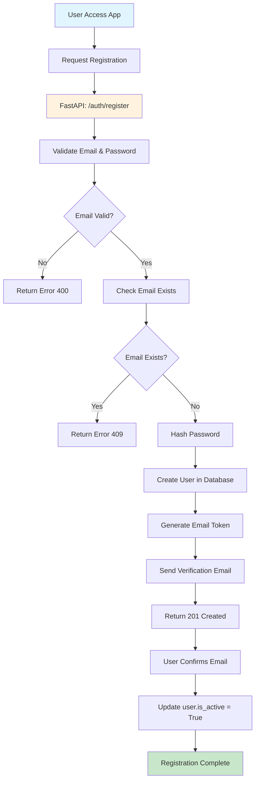

#### Flow 1.2: User Login Flow
Shows the authentication process with JWT token generation.

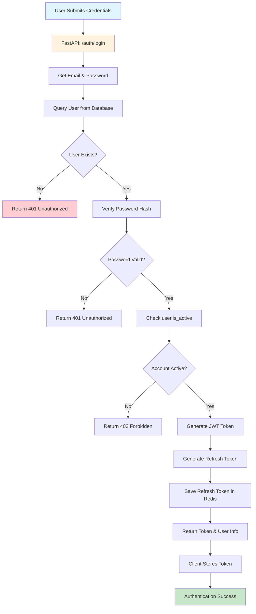

#### Flow 1.3: Token Refresh Flow
Shows the process of refreshing expired access tokens.

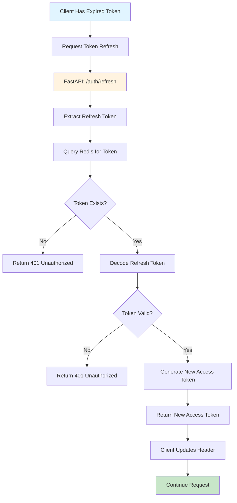

#### Sequence 1.4: Complete Authentication Flow
Shows the interaction between Client, API, Database, and Redis.

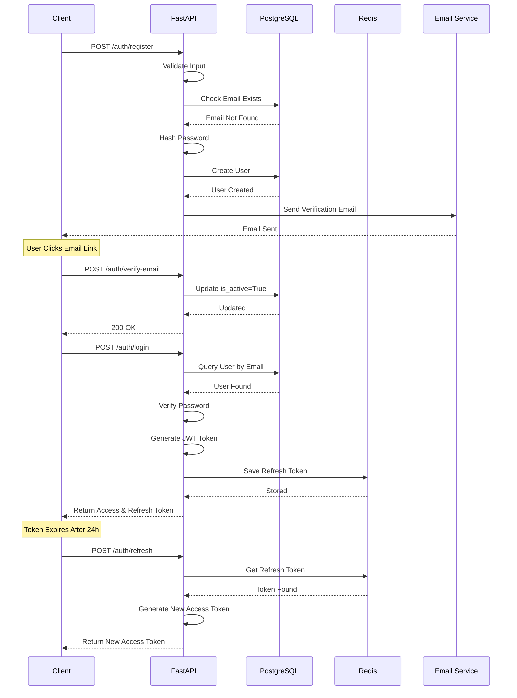

---

## 2. Audio Management Flows

### File: `diagrams/02_audio_management_flows.md`

#### Flow 2.1: Audio Upload Flow
Shows the complete process of uploading an audio file.

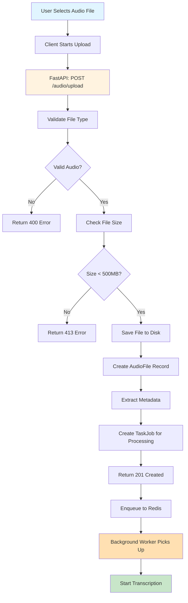

#### Flow 2.2: Audio Processing Pipeline
Shows the async processing of uploaded audio files.

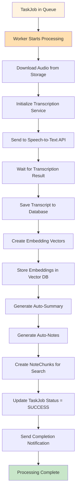

#### Flow 2.3: Audio Retrieval & Metadata
Shows how users retrieve audio files and associated metadata.

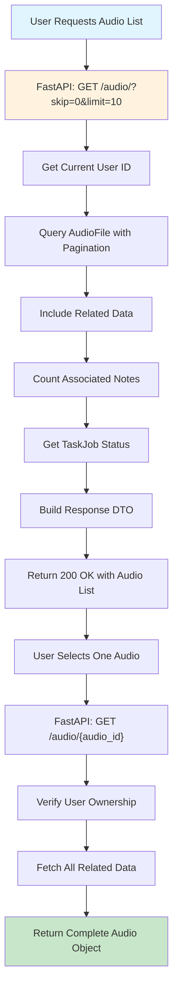

#### Sequence 2.4: Complete Audio Upload & Processing
Shows the interaction between Client, API, Storage, Worker, and External APIs.

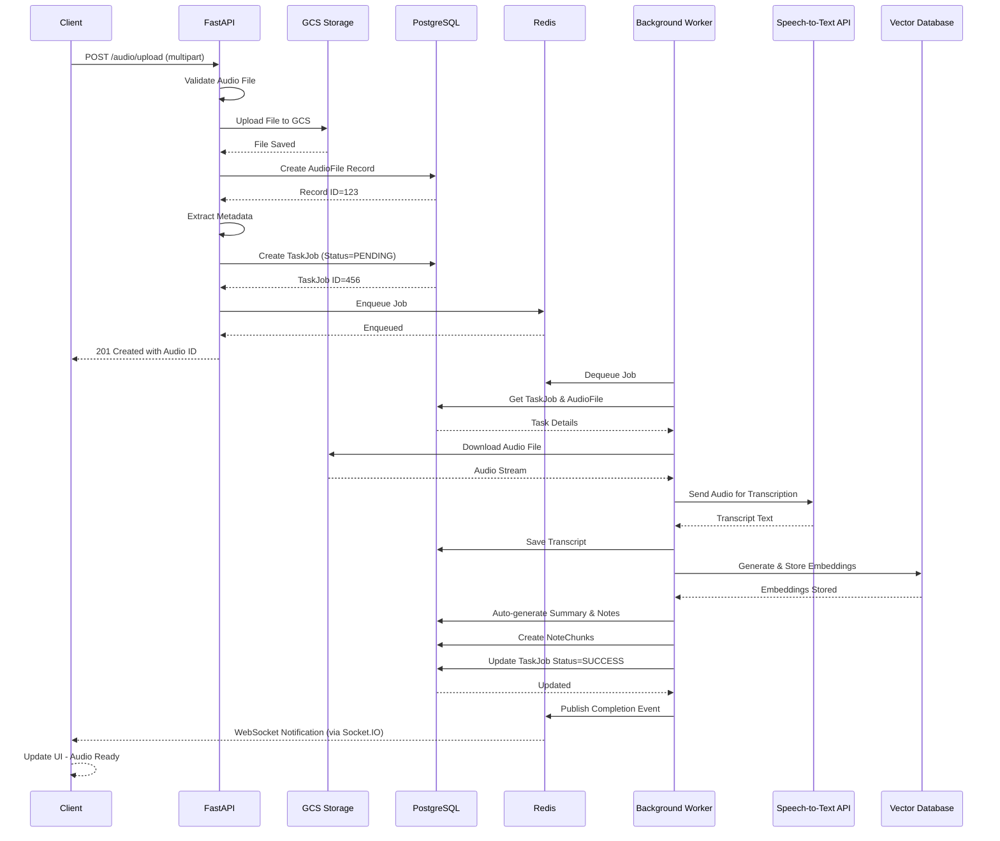

---

## 3. Async Task Processing

### File: `diagrams/03_async_task_processing.md`

#### Flow 3.1: Task Job Lifecycle
Shows the complete lifecycle of a background task.

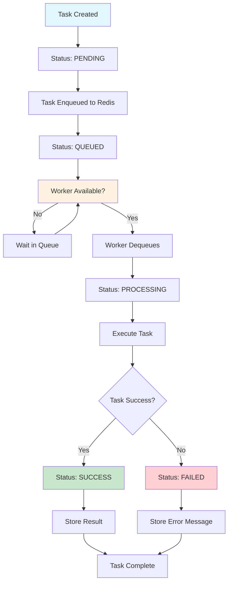

#### Flow 3.2: Error Handling & Retry
Shows error handling and automatic retry mechanism.

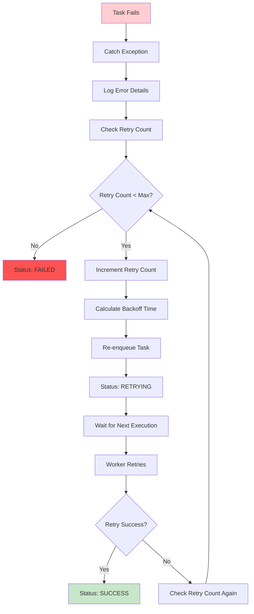

#### Sequence 3.3: Task Processing with Worker
Shows the detailed interaction between API, Redis, Worker, and Services.

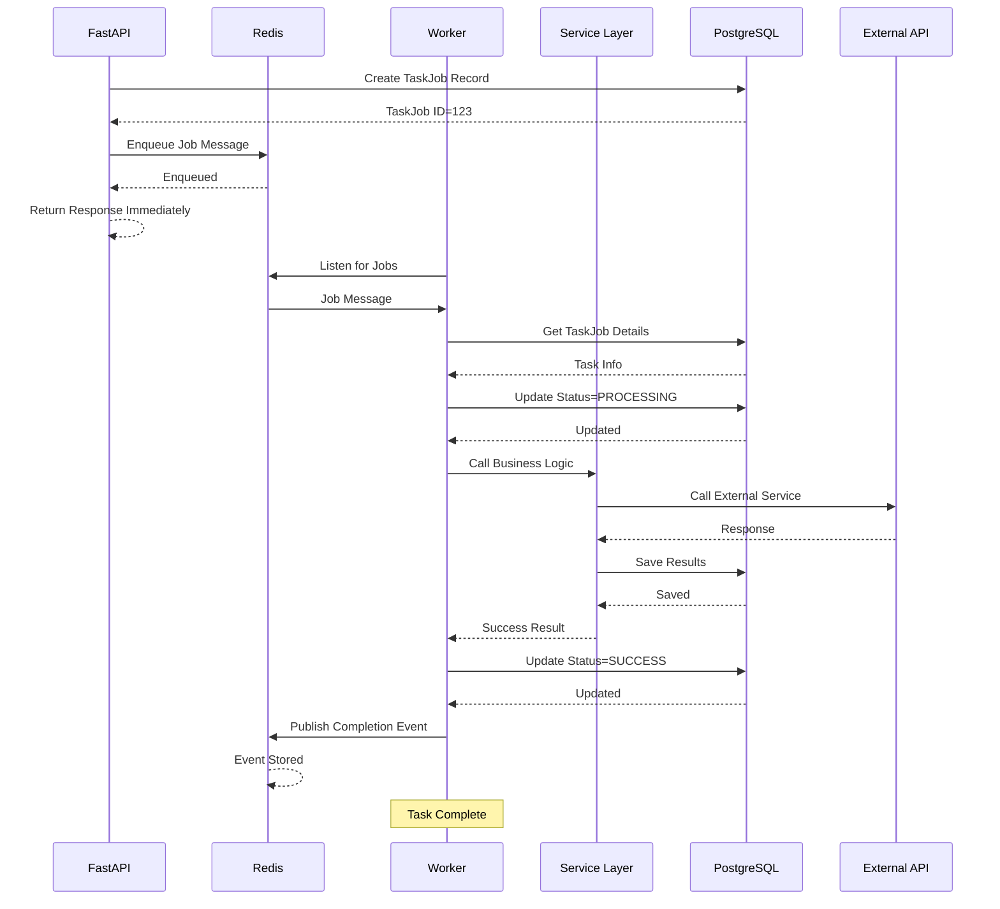

---

## 4. Note Generation Flows

### File: `diagrams/04_note_generation_flows.md`

#### Flow 4.1: Automatic Note Generation from Audio
Shows how notes are automatically generated from transcribed audio.

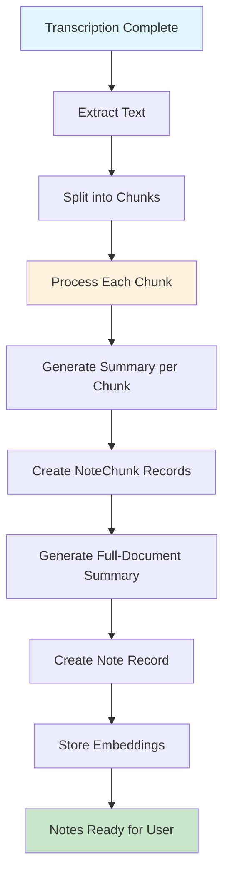

#### Flow 4.2: User Creates Manual Notes
Shows the process of users creating and editing notes manually.

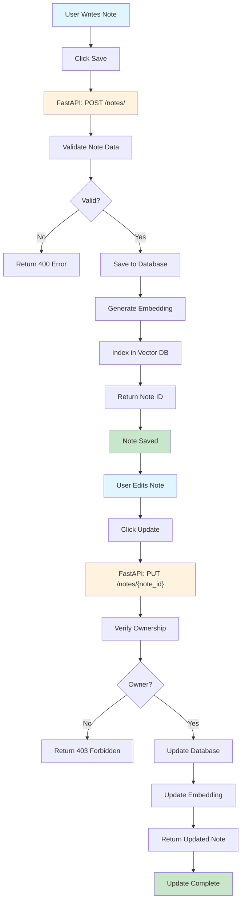

#### Flow 4.3: Note Search with Embeddings
Shows semantic search functionality using embeddings.

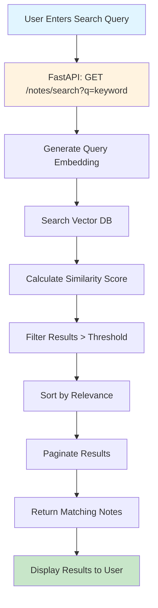

#### Sequence 4.4: Complete Note Lifecycle
Shows interaction from audio transcription to note search.

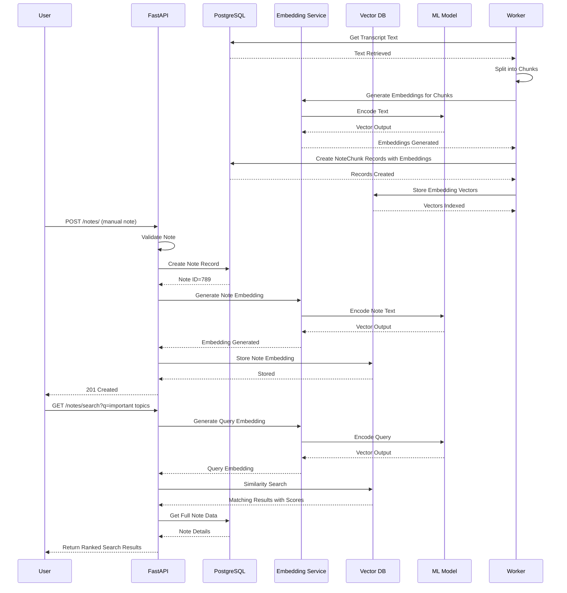

---

## 5. Chatbot Interaction Flows

### File: `diagrams/05_chatbot_interaction_flows.md`

#### Flow 5.1: Chatbot Session Initialization
Shows how a chatbot session is created and initialized.

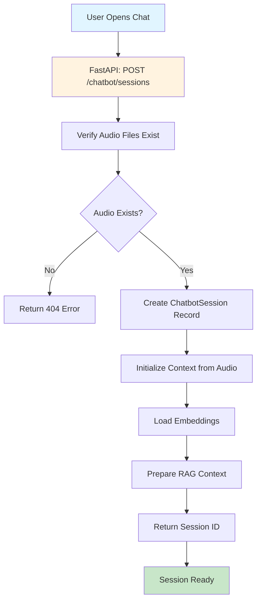

#### Flow 5.2: RAG-based Chatbot Response Generation
Shows how the chatbot generates contextual responses using RAG.

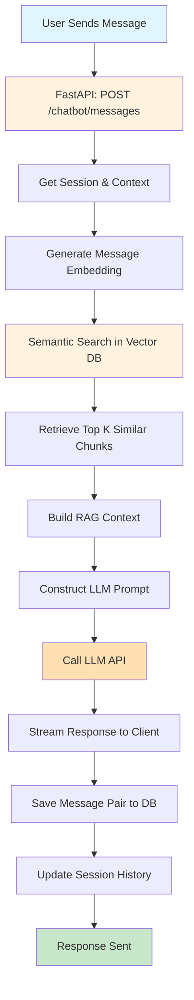

#### Flow 5.3: Intent Detection
Shows how user intents are detected and routed.

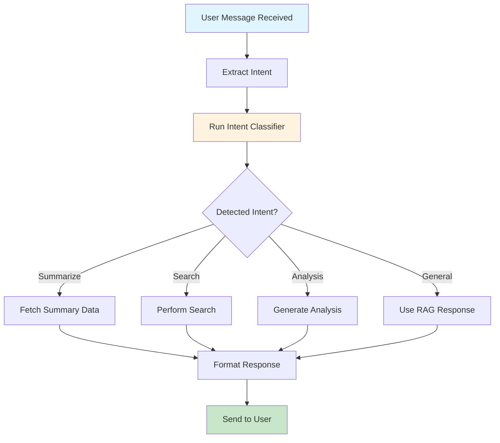

#### Sequence 5.4: Complete Chatbot Interaction
Shows the full flow from message to response.

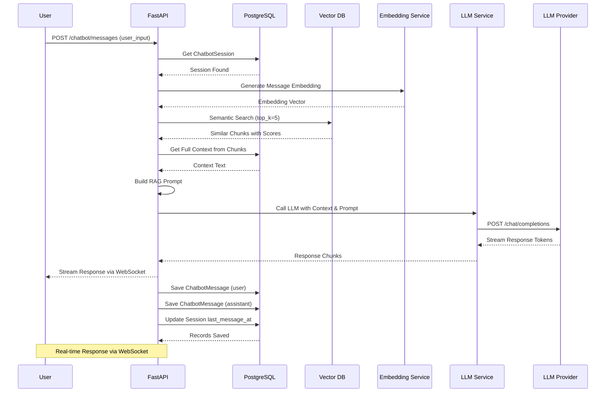

---

## 6. Folder Organization Flows

### File: `diagrams/06_folder_organization_flows.md`

#### Flow 6.1: Folder Creation & Management
Shows how users create and manage folders.

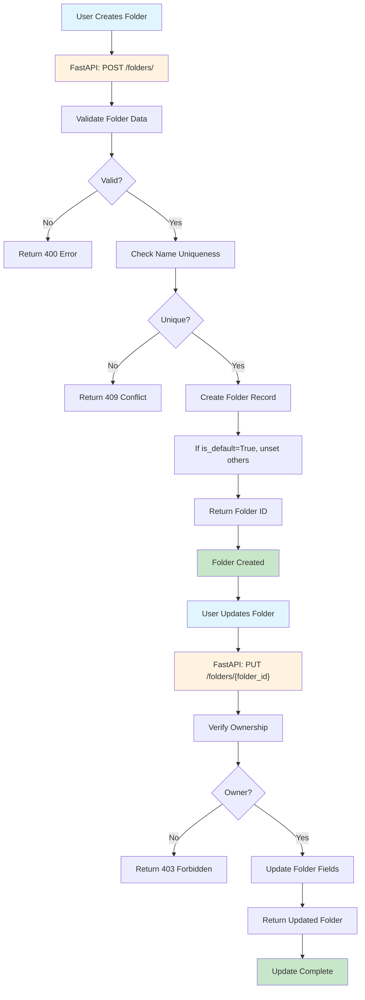

#### Flow 6.2: Audio Organization into Folders
Shows moving audio files between folders.

```mermaid
flowchart TD
    A["User Selects Audio"] --> B["Click Move to Folder"]
    B --> C["FastAPI: POST /folders/move-audio"]
    C --> D["Verify Audio Ownership"]
    D --> E{Owned?}
    E -->|No| F["Return 403 Forbidden"]
    E -->|Yes| G["Verify Folder Ownership"]
    G --> H{Folder Owned?}
    H -->|No| I["Return 403 Forbidden"]
    H -->|Yes| J["Update audio.folder_id"]
    J --> K["Save to Database"]
    K --> L["Return Success"]
    L --> M["Audio Moved"]
    
    style A fill:#e1f5ff
    style C fill:#fff3e0
    style M fill:#c8e6c9
```

#### Flow 6.3: Folder Deletion with Cascading
Shows what happens when a folder is deleted.

```mermaid
flowchart TD
    A["User Deletes Folder"] --> B["FastAPI: DELETE /folders/{folder_id}"]
    B --> C["Verify Ownership"]
    C --> D{Owner?}
    D -->|No| E["Return 403 Forbidden"]
    D -->|Yes| F["Get All Audio in Folder"]
    F --> G["Unassign Audio (set folder_id=NULL)"]
    G --> H["Delete Folder Record"]
    H --> I["Return 204 No Content"]
    I --> J["Folder Deleted, Audio Unassigned"]
    
    style A fill:#e1f5ff
    style B fill:#fff3e0
    style J fill:#c8e6c9
```

#### Sequence 6.4: Complete Folder Management
Shows full interaction from folder creation to audio organization.

```mermaid
sequenceDiagram
    participant User
    participant FastAPI
    participant Database as PostgreSQL

    User->>FastAPI: POST /folders/
    FastAPI->>FastAPI: Validate Input
    FastAPI->>Database: Check Name Uniqueness
    Database-->>FastAPI: Available
    FastAPI->>Database: Create Folder
    Database-->>FastAPI: Folder ID=10
    FastAPI-->>User: 201 Created

    User->>FastAPI: GET /folders/
    FastAPI->>Database: Query User Folders
    Database-->>FastAPI: Folder List
    FastAPI->>Database: Count Audio per Folder
    Database-->>FastAPI: Counts
    FastAPI-->>User: Return Folders with Counts

    User->>FastAPI: POST /folders/move-audio
    FastAPI->>Database: Get AudioFile
    Database-->>FastAPI: Audio Found
    FastAPI->>Database: Get Folder
    Database-->>FastAPI: Folder Found
    FastAPI->>Database: Update audio.folder_id=10
    Database-->>FastAPI: Updated
    FastAPI-->>User: 200 OK

    User->>FastAPI: GET /folders/{folder_id}/audio
    FastAPI->>Database: Get Audio in Folder
    Database-->>FastAPI: Audio List
    FastAPI-->>User: Return Paginated Audio Files

    User->>FastAPI: DELETE /folders/{folder_id}
    FastAPI->>Database: Get All Audio in Folder
    Database-->>FastAPI: Audio List
    FastAPI->>Database: Unassign All Audio
    Database-->>FastAPI: Updated
    FastAPI->>Database: Delete Folder
    Database-->>FastAPI: Deleted
    FastAPI-->>User: 204 No Content
```

---

## 7. Notification System Flows

### File: `diagrams/07_notification_system_flows.md`

#### Flow 7.1: Notification Trigger & Queue
Shows how notifications are triggered and queued.

```mermaid
flowchart TD
    A["Event Occurs"] --> B["Event Type?"]
    B -->|Audio Processed| C["Transcription Completed"]
    B -->|Task Failed| D["Task Failed"]
    B -->|Note Created| E["Note Auto-Generated"]
    B -->|User Action| F["Manual Event"]
    C --> G["Create Notification Record"]
    D --> G
    E --> G
    F --> G
    G --> H["Store in Database"]
    H --> I["Enqueue to Redis"]
    I --> J["Query User Preferences"]
    J --> K["Check Notification Settings"]
    K --> L["Should Send?"]
    L -->|Yes| M["Prepare Notification Payload"]
    L -->|No| N["Skip"]
    M --> O["Send via Channels"]
    
    style A fill:#e1f5ff
    style G fill:#fff3e0
    style O fill:#c8e6c9
```

#### Flow 7.2: Multi-Channel Notification Delivery
Shows how notifications are delivered via multiple channels.

```mermaid
flowchart TD
    A["Notification Ready"] --> B{Enabled Channels?}
    B -->|Push FCM| C["Firebase Cloud Messaging"]
    B -->|In-App| D["WebSocket Event"]
    B -->|Email| E["Email Service"]
    C --> F["Send FCM Push"]
    D --> G["Broadcast via Socket.IO"]
    E --> H["Send Email"]
    F --> I["Device Receives Push"]
    G --> J["Update In-App UI"]
    H --> K["User Receives Email"]
    I --> L["User Sees Notification"]
    J --> L
    K --> L
    
    style A fill:#e1f5ff
    style C fill:#fff3e0
    style D fill:#fff3e0
    style E fill:#fff3e0
    style L fill:#c8e6c9
```

#### Flow 7.3: Notification Preferences Management
Shows how users manage notification settings.

```mermaid
flowchart TD
    A["User Opens Settings"] --> B["FastAPI: GET /notifications/preferences"]
    B --> C["Get User Preferences"]
    C --> D["Return Settings"]
    D --> E["User Changes Preferences"]
    E --> F["FastAPI: PUT /notifications/preferences"]
    F --> G["Validate Settings"]
    G --> H["Update Database"]
    H --> I["Clear Cache"]
    I --> J["Return Success"]
    J --> K["Preferences Updated"]
    
    style A fill:#e1f5ff
    style B fill:#fff3e0
    style F fill:#fff3e0
    style K fill:#c8e6c9
```

#### Sequence 7.4: End-to-End Notification Flow
Shows the complete notification journey from event to delivery.

```mermaid
sequenceDiagram
    participant Worker as Background Worker
    participant Database as PostgreSQL
    participant Redis
    participant NotificationService as Notification Service
    participant Socket as WebSocket/Socket.IO
    participant FCM as Firebase Cloud Messaging
    participant EmailService as Email Service
    participant Client

    Worker->>Database: Task Complete
    Database-->>Worker: Task Updated
    Worker->>Database: Create Notification Record
    Database-->>Worker: Notification ID=999
    Worker->>Redis: Enqueue Notification Event
    Redis-->>Worker: Enqueued

    NotificationService->>Redis: Dequeue Notification
    NotificationService->>Database: Get User Preferences
    Database-->>NotificationService: Preferences
    NotificationService->>NotificationService: Check Settings
    
    NotificationService->>Socket: Broadcast In-App Event
    Socket-->>Client: Real-time Notification
    Client-->>Client: Update UI

    NotificationService->>Database: Get User FCM Tokens
    Database-->>NotificationService: Device Tokens
    NotificationService->>FCM: Send Push Notification
    FCM-->>NotificationService: Delivery Confirmed
    FCM-->>Client: Push Notification
    Client-->>Client: Display Notification

    NotificationService->>EmailService: Send Email Notification
    EmailService-->>EmailService: Format Email
    EmailService-->>Client: Email Received
    
    NotificationService->>Database: Mark Notification Sent
    Database-->>NotificationService: Updated
```

---

## 8. Database Relationships

### File: `diagrams/08_database_relationships.md`

#### Diagram 8.1: Complete Entity Relationship Diagram
Shows all database tables and their relationships.

```mermaid
erDiagram
    USER ||--o{ AUDIO_FILE : uploads
    USER ||--o{ FOLDER : owns
    USER ||--o{ NOTE : creates
    USER ||--o{ TASK_JOB : initiates
    USER ||--o{ CHATBOT_SESSION : starts
    USER ||--o{ NOTIFICATION : receives
    USER ||--o{ USER_DEVICE : registers
    
    FOLDER ||--o{ AUDIO_FILE : contains
    
    AUDIO_FILE ||--o{ NOTE : references
    AUDIO_FILE ||--o{ TASK_JOB : processes
    AUDIO_FILE ||--o{ CHATBOT_SESSION : analyzes
    AUDIO_FILE ||--o{ NOTE_CHUNK : generates
    
    NOTE ||--o{ NOTE_CHUNK : splits
    
    CHATBOT_SESSION ||--o{ CHATBOT_MESSAGE : contains
    
    TASK_JOB {
        int id
        int user_id
        int audio_id
        string task_type
        string status
        string progress
        datetime created_at
        datetime updated_at
    }
    
    USER {
        int id
        string email
        string password_hash
        string full_name
        boolean is_active
        datetime created_at
    }
    
    AUDIO_FILE {
        int id
        int user_id
        int folder_id
        string filename
        string gcs_path
        string mime_type
        int duration_seconds
        datetime created_at
    }
    
    FOLDER {
        int id
        int user_id
        string name
        string description
        string color
        boolean is_default
        datetime created_at
    }
    
    NOTE {
        int id
        int user_id
        int audio_id
        string title
        string content
        datetime created_at
        datetime updated_at
    }
    
    NOTE_CHUNK {
        int id
        int note_id
        int audio_id
        string chunk_text
        vector embedding
        int start_time
        int end_time
    }
    
    CHATBOT_SESSION {
        int id
        int user_id
        int audio_id
        string title
        datetime created_at
    }
    
    CHATBOT_MESSAGE {
        int id
        int session_id
        string role
        string content
        datetime created_at
    }
    
    NOTIFICATION {
        int id
        int user_id
        string type
        string title
        string message
        boolean is_read
        datetime created_at
    }
    
    USER_DEVICE {
        int id
        int user_id
        string fcm_token
        string device_name
        string os
        datetime registered_at
    }
```

#### Diagram 8.2: Data Flow Through the System
Shows how data flows from input to storage.

```mermaid
graph LR
    A["User Input"] --> B["FastAPI<br/>Validation"]
    B --> C["Database<br/>Storage"]
    C --> D["Cache<br/>Redis"]
    D --> E["Search<br/>Vector DB"]
    E --> F["External API<br/>Processing"]
    F --> G["Result<br/>Storage"]
    G --> H["Return to<br/>User"]
    
    style A fill:#e1f5ff
    style B fill:#fff3e0
    style C fill:#fff3e0
    style D fill:#fff3e0
    style E fill:#fff3e0
    style F fill:#ffe0b2
    style G fill:#fff3e0
    style H fill:#c8e6c9
```

---

## Implementation Instructions

### For Each Diagram File

#### Step 1: File Creation
Create a new markdown file in `docs/diagrams/` directory:
```
docs/diagrams/01_authentication_flows.md
docs/diagrams/02_audio_management_flows.md
docs/diagrams/03_async_task_processing.md
docs/diagrams/04_note_generation_flows.md
docs/diagrams/05_chatbot_interaction_flows.md
docs/diagrams/06_folder_organization_flows.md
docs/diagrams/07_notification_system_flows.md
docs/diagrams/08_database_relationships.md
```

#### Step 2: Content Structure for Each File
Each diagram file should follow this structure:

```markdown
# [Module Name] Diagrams

## Overview
[Brief description of what this module does]

## Flow Diagrams

### Flow X.1: [Flow Name]
[Description of the flow]

\`\`\`mermaid
[Mermaid flowchart code]
\`\`\`

### Flow X.2: [Next Flow Name]
[Description]

\`\`\`mermaid
[Mermaid code]
\`\`\`

## Sequence Diagrams

### Sequence X.3: [Complete Process Name]
[Description of participants and interactions]

\`\`\`mermaid
[Mermaid sequence diagram code]
\`\`\`

## Key Components
- List important services
- List important models
- List important endpoints

## Error Handling
- Common errors
- Retry mechanisms
- Fallback strategies

## Performance Notes
- Caching strategies
- Pagination
- Optimization tips
```

#### Step 3: Styling Conventions

Use these colors in your flowcharts for consistency:
- **Input/Start**: `fill:#e1f5ff` (Light Blue)
- **Processing**: `fill:#fff3e0` (Light Orange)
- **External/Async**: `fill:#ffe0b2` (Darker Orange)
- **Output/Success**: `fill:#c8e6c9` (Light Green)
- **Error/Failure**: `fill:#ffcdd2` (Light Red)
- **Critical**: `fill:#ff5252` (Red)

---

## Creating New Diagrams

### Mermaid Flowchart Syntax
```markdown
flowchart TD
    A["Node Label"] --> B["Another Node"]
    B --> C{Decision?}
    C -->|Yes| D["Success"]
    C -->|No| E["Failure"]
    
    style A fill:#e1f5ff
    style D fill:#c8e6c9
```

### Mermaid Sequence Diagram Syntax
```markdown
sequenceDiagram
    participant A
    participant B
    participant C
    
    A->>B: Message
    B->>C: Process
    C-->>B: Response
    B-->>A: Final Result
```

### Mermaid ER Diagram Syntax
```markdown
erDiagram
    ENTITY_A ||--o{ ENTITY_B : relationship
    
    ENTITY_A {
        type column_name
        type column_name
    }
```

---

## Integration with Documentation

### Referencing Diagrams
In other documentation files, reference diagrams like:

```markdown
See [Authentication Flow Diagram](diagrams/01_authentication_flows.md#flow-11-user-registration-flow)
for the complete registration process.
```

### Embedding in README
Add a summary section in main README:

```markdown
## System Architecture

### User Flows
- [Authentication](docs/diagrams/01_authentication_flows.md)
- [Audio Management](docs/diagrams/02_audio_management_flows.md)

### Processing Flows
- [Async Tasks](docs/diagrams/03_async_task_processing.md)
- [Audio Processing](docs/diagrams/02_audio_management_flows.md)

### Feature Flows
- [Notes](docs/diagrams/04_note_generation_flows.md)
- [Chatbot](docs/diagrams/05_chatbot_interaction_flows.md)
- [Folders](docs/diagrams/06_folder_organization_flows.md)
- [Notifications](docs/diagrams/07_notification_system_flows.md)

### Data Model
- [Database Schema](docs/diagrams/08_database_relationships.md)
```

---

## Best Practices

### Do's ✓
- Keep flows focused on a single feature
- Use clear, descriptive labels
- Include error paths in sequences
- Show data transformations
- Document external service calls
- Use consistent styling
- Break complex flows into multiple diagrams

### Don'ts ✗
- Don't overcrowd a single diagram
- Don't mix multiple unrelated processes
- Don't forget error handling
- Don't omit database operations
- Don't use ambiguous node names
- Don't ignore async operations
- Don't forget user verification/authorization

---

## Updating Diagrams

When the system changes:

1. **Identify affected diagrams**
   - List which flows are impacted
   - Check related sequences

2. **Update diagrams**
   - Modify flowchart nodes
   - Update sequence participants
   - Adjust decision points

3. **Update documentation**
   - Add notes about the change
   - Update version/date
   - Link to related changes

4. **Version control**
   - Commit diagram changes with code changes
   - Add descriptive commit messages

---

## Viewing Diagrams

### Online Tools
- **Mermaid Live Editor**: https://mermaid.live/
- **Mermaid Documentation**: https://mermaid.js.org/
- **GitHub**: Automatically renders in markdown files

### Local Rendering
1. Install Mermaid CLI:
   ```bash
   npm install -g @mermaid-js/mermaid-cli
   ```

2. Generate SVG:
   ```bash
   mmdc -i diagram.md -o diagram.svg
   ```

3. View in VS Code:
   - Install "Markdown Preview Mermaid Support" extension

---

## Testing Diagrams

Before publishing:

1. **Syntax Validation**
   - Paste code in https://mermaid.live/
   - Check for syntax errors

2. **Completeness Check**
   - All flows have start and end
   - All decision nodes have branches
   - All participants in sequences are used

3. **Accuracy Check**
   - Matches actual code implementation
   - Includes all error paths
   - Database operations are correct

4. **Clarity Review**
   - Ask colleague to review
   - Check for ambiguous labels
   - Verify styling is consistent

---

## Useful Examples

### Example 1: Simple API Endpoint Flow
```mermaid
flowchart TD
    A["Client Request"] --> B["API Handler"]
    B --> C["Validate Input"]
    C --> D{Valid?}
    D -->|No| E["Return 400 Error"]
    D -->|Yes| F["Process Request"]
    F --> G["Save to DB"]
    G --> H["Return 200 OK"]
    
    style A fill:#e1f5ff
    style F fill:#fff3e0
    style H fill:#c8e6c9
```

### Example 2: Async Task with Retry
```mermaid
sequenceDiagram
    participant Client
    participant API
    participant Queue as Redis Queue
    participant Worker
    participant ExternalService
    
    Client->>API: Request async operation
    API->>Queue: Enqueue task
    Queue-->>API: Task ID
    API-->>Client: 202 Accepted
    
    Worker->>Queue: Dequeue task
    Worker->>ExternalService: Call API
    ExternalService-->>Worker: Error
    Worker->>Queue: Re-enqueue with backoff
    Queue-->>Worker: Requeued
    
    Worker->>ExternalService: Retry call
    ExternalService-->>Worker: Success
    Worker->>Queue: Mark complete
```

---

## FAQ

**Q: Should I include all error cases?**
A: Yes, especially in sequence diagrams. Show common errors and how they're handled.

**Q: How detailed should diagrams be?**
A: Show the main flow clearly. Use separate diagrams for complex details.

**Q: Should I include database transaction details?**
A: Show key operations (create, read, update, delete) but don't overcomplicate.

**Q: How often should I update diagrams?**
A: Whenever the flow changes significantly, update diagrams before code review.

**Q: Can I use different colors?**
A: Yes, but maintain consistency across all diagrams.

---

## Support & Maintenance

- **Diagram Issues**: Check Mermaid documentation
- **Syntax Errors**: Use Mermaid Live Editor for debugging
- **Questions**: Refer to implementation code for details
- **Updates**: Keep version history in commit messages

---

**Document Version**: 1.0  
**Last Updated**: December 30, 2025  
**Maintained By**: Development Team
